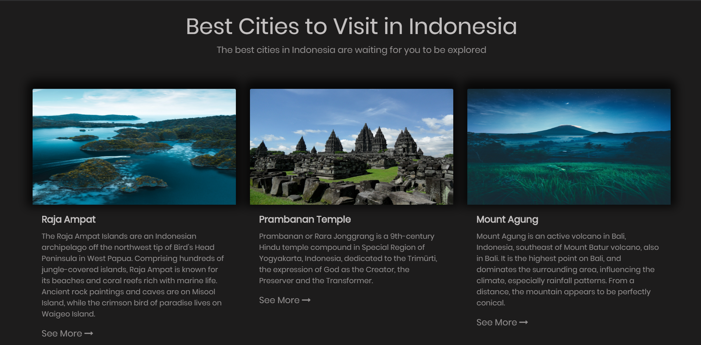

# Demo Travel Site

USED:

- HTML5
- CSS3
- JS
- BootStrap

Main Header has Carasouel using Bootstrap for different countries with which the cards and details changes (JS) as per the slide active. Also used Smooth Scroll JS.

## Sample Shots:

Responsive- Moblie View
 

